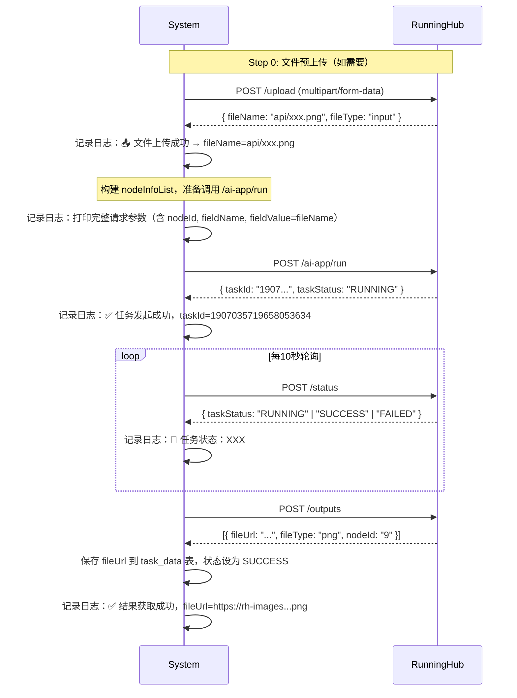

```markdown
# 📄 ERP 系统需求规格说明书 v3.1（AI IDE 最终优化版）

> **系统名称**：RunningHub 工作流自动化执行平台  
> **核心目标**：实现“模板定义 → 任务创建 → 文件预上传 → API 自动执行 → 实时日志追踪 → 结果可视化”全流程闭环，**确保每一步参数可追溯、结果可预览、错误可定位**。

---

## 🎯 一、系统核心目的与流程（含文件上传 & 参数日志）

### 1.1 核心功能闭环

| 阶段 | 功能描述 | 技术实现要点 |
|------|----------|--------------|
| **① 自定义表单模板** | 用户通过可视化界面创建可复用模板，支持字段类型：`image`, `video`, `text`, `number` | 前端拖拽/表单配置 + 后端模板存储（SQLite） |
| **② 任务创建与文件预上传** | 用户填写表单 → **若含图片/视频，先调用 RunningHub `/upload` 接口 → 获取 `fileName` → 替换原文件路径** → 生成任务 | 前端上传组件 + 后端调用 `/upload` API + 替换 `fieldValue` 为 `fileName` |
| **③ API 自动化交互** | 1. 发起任务 → 2. 每10秒轮询状态 → 3. 成功后拉取结果 → **每步记录执行日志并推送到前端（含完整请求参数）** | 异步调度 + 状态机 + 日志记录器 + SSE 推送 |
| **④ 任务管理与详情** | 列表页统一管理 → 详情页展示：原始数据、**时间轴执行日志（含 API 参数）**、**结果文件预览（图片/视频）** | 前端日志流组件 + `` / `<video>` 标签渲染 |

> ✅ **关键补充说明**：
> - 所有 `image` / `video` 类型字段，在调用 `ai-app/run` 前，**必须先上传至 RunningHub**，获取 `fileName` 后作为 `fieldValue` 传入。
> - 详情页需支持 **执行日志实时流式展示**，**必须包含发起 `/ai-app/run` 时的完整请求参数 JSON**，便于调试字段格式。

---

## 🖥️ 二、UI/UX 设计规范（更新）

### 2.1 布局结构（保持原结构）

- **整体布局**：左侧垂直菜单栏（默认折叠，点击展开）
- **页面风格**：极简现代风，使用 CSS Grid/Flex 布局，支持响应式
- **交互原则**：所有操作无刷新（SPA 风格），通过 `fetch` + `EventSource` 实现数据动态更新

### 2.2 页面路由（保持原结构，增强详情页）

| 路径 | 页面名称 | 功能描述 |
|------|----------|----------|
| `/workflows` | 工作流列表页 | 展示所有模板，支持新建、编辑、删除、执行 |
| `/workflows/new` | 新建工作流页 | 表单配置界面，支持添加/编辑节点 |
| `/tasks/create/:workflowId` | 任务创建页 | 根据模板动态渲染输入表单（含文件上传） |
| `/tasks` | 任务列表页 | 展示所有任务，支持运行、停止、查看详情 |
| `/tasks/:taskId` | **任务详情页（增强）** | 展示：原始表单数据、**执行日志流（含 API 参数）**、**结果文件预览** |

---

## ⚙️ 三、功能模块详细说明（全面增强版）

### 3.1 工作流列表页 (`/workflows`) — 保持不变

（同原文档，此处略）

---

### 3.2 任务创建页 (`/tasks/create/:workflowId`) — 增强文件上传

- **功能**：根据 workflowId 动态渲染表单
- **字段渲染规则**：

| 节点类型 | 前端控件 |
|----------|----------|
| `image` | `<input type="file" accept="image/*">` + 预览图 |
| `video` | `<input type="file" accept="video/*">` + 视频缩略图 |
| `text` | `<input type="text">` |
| `number` | `<input type="number">` |

- **提交逻辑（关键增强）**：
  - 点击“创建任务” → 数据 POST 至后端 `/api/tasks`
  - **后端检测文件字段 → 调用 RunningHub `/upload` → 替换 `fieldValue` 为返回的 `fileName`**
  - 创建任务记录，状态设为 `"PENDING"`，返回 `taskId`
  - 前端跳转至 `/tasks` 任务列表页

---

### 3.3 任务列表页 (`/tasks`) — 保持不变

（同原文档，此处略）

---

### 3.4 任务详情页 (`/tasks/:taskId`) — **核心增强：日志含参数 + 9:16缩略图结果预览 + 本地文件管理**

#### 页面结构

```html
<div class="task-detail">
  <h2>任务详情 #{{ taskId }}</h2>

  <!-- 原始表单数据 -->
  <section>
    <h3>输入参数</h3>
    <ul id="input-data-list">
      <!-- 动态渲染：字段名 + 值（文件显示为预览图/播放器） -->
    </ul>
  </section>

  <!-- 执行日志流（核心新增） -->
  <section>
    <h3>执行日志</h3>
    <div id="execution-logs" class="log-stream">
      <!-- 示例条目 -->
      <div class="log-entry">
        <span class="timestamp">[14:23:05]</span>
        <span class="message">📤 文件上传成功 → fileName=api/xxx.png</span>
      </div>
      <div class="log-entry">
        <span class="timestamp">[14:23:07]</span>
        <span class="message">🚀 准备调用 create，请求参数：</span>
        <pre class="json-log">{
  "workflowId": "1956307610033160194",
  "apiKey": "d4b17e6ea9474695965f3f3c9dd53c1d",
  "nodeInfoList": [
    {
      "nodeId": "156",
      "fieldName": "image",
      "fieldValue": "api/xxx.png"
    },
    {
      "nodeId": "145",
      "fieldName": "image",
      "fieldValue": "api/yyy.png"
    }
  ]
}</pre>
      </div>
      <div class="log-entry">
        <span class="timestamp">[14:23:08]</span>
        <span class="message">✅ 任务发起成功，taskId=1965966889119887362</span>
      </div>
      <div class="log-entry">
        <span class="timestamp">[14:23:18]</span>
        <span class="message">🔄 任务状态：RUNNING</span>
      </div>
      <div class="log-entry">
        <span class="timestamp">[14:23:48]</span>
        <span class="message">✅ 任务成功，已下载并保存2个输出文件到本地</span>
      </div>
    </div>
  </section>

  <!-- 结果文件预览 - TikTok风格9:16缩略图卡片 -->
  <section>
    <h3>输出结果</h3>
    <div id="result-preview" class="result-gallery">
      <!-- 卡片网格布局，支持9:16比例缩略图 -->
      <div class="result-card" data-file-type="png">
        <div class="image-preview">
          
          <div class="image-overlay">
            <button class="btn-preview" onclick="openImageModal('/static/outputs/images/xxx.png')">
              <i class="icon-zoom"></i> 预览
            </button>
          </div>
        </div>
        <div class="card-info">
          <div class="card-title">节点 395</div>
          <div class="card-meta">
            <span class="file-size">1.2 MB</span>
            <span class="created-time">2025-09-11 10:50:06</span>
          </div>
          <div class="card-actions">
            <a href="/static/outputs/images/xxx.png" download class="btn btn-download">
              <i class="icon-download"></i> 下载
            </a>
            <a href="https://rh-images.xiaoyaoyou.com/output/xxx.png" target="_blank" class="btn btn-external">
              <i class="icon-external"></i> 原始链接
            </a>
          </div>
        </div>
      </div>
    </div>
  </section>
</div>
```

#### 新增功能特性

1. **9:16 (TikTok) 比例缩略图**：
   - 缩略图尺寸：270x480像素，精确9:16比例
   - 智能裁剪：自动识别原图比例并裁剪重要内容
   - 适配移动端：完美支持竖屏浏览体验

2. **本地文件存储管理**：
   - 自动下载：任务完成后自动下载RunningHub输出文件
   - 分类存储：`outputs/images/2025/09/` 按年月归档
   - 缩略图存储：`outputs/images/thumbnails/2025/09/` 单独存储
   - 数据库记录：`task_outputs` 表记录本地路径和元数据

3. **卡片式UI设计**：
   - 网格布局：响应式卡片网格，最小宽度260px
   - 悬停效果：卡片阴影和图片缩放动画
   - 交互丰富：点击预览、下载按钮、原始链接
   - 文件信息：文件大小、创建时间、节点ID显示

---

## 🛠️ 四、技术架构与实现规范（全面增强）

### 4.1 后端技术栈（Flask + SQLite + PIL）— 增强本地文件管理与9:16缩略图生成

```python
# 核心模块结构（增强版）
app/
├── models/
│   ├── Workflow.py
│   ├── Task.py
│   ├── TaskLog.py          # ✅ 任务日志模型
│   └── TaskOutput.py       # ✅ 新增：输出文件本地存储模型
├── managers/
│   ├── WorkflowManager.py
│   └── TaskQueueManager.py # ✅ 增强：集成文件上传 + 本地文件下载 + 日志记录
├── api/
│   ├── workflows.py
│   ├── tasks.py
│   ├── task_logs.py        # ✅ SSE 日志流接口
│   └── outputs.py          # ✅ 新增：输出文件管理API
├── services/
│   ├── runninghub.py       # ✅ 增强：upload_file + run_task（打印参数）
│   └── file_manager.py     # ✅ 新增：本地文件管理 + 9:16缩略图生成
├── routes.py               # ✅ 增强：静态文件服务路由
└── app.py
```

### 4.2 新增核心模块详解

#### TaskOutput 模型 (app/models/TaskOutput.py)
```python
class TaskOutput(db.Model):
    __tablename__ = 'task_outputs'
    
    id = db.Column(db.Integer, primary_key=True)
    task_id = db.Column(db.String(36), db.ForeignKey('tasks.task_id'))
    node_id = db.Column(db.String(100), nullable=False)
    file_url = db.Column(db.Text, nullable=False)          # RunningHub原始URL
    local_path = db.Column(db.Text, nullable=False)        # 本地存储路径
    thumbnail_path = db.Column(db.Text, nullable=True)     # 9:16缩略图路径
    file_type = db.Column(db.String(10), nullable=False)   # png/jpg/mp4等
    file_size = db.Column(db.Integer, nullable=True)       # 文件大小（字节）
    created_at = db.Column(db.DateTime, default=datetime.utcnow)
```

#### FileManager 服务 (app/services/file_manager.py)
```python
class FileManager:
    def download_and_save_outputs(self, task_id, outputs):
        """下载RunningHub输出文件并生成9:16缩略图"""
        for output in outputs:
            # 1. 下载原始文件到 outputs/images/2025/09/
            local_path = self._download_file(output['fileUrl'], task_id)
            
            # 2. 生成270x480的9:16比例缩略图
            thumbnail_path = self._generate_thumbnail(local_path, size=(270, 480))
            
            # 3. 保存到数据库
            task_output = TaskOutput(
                task_id=task_id,
                node_id=output['nodeId'],
                file_url=output['fileUrl'],
                local_path=local_path,
                thumbnail_path=thumbnail_path,
                file_type=output['fileType'],
                file_size=len(file_data)
            )
            db.session.add(task_output)
    
    def _generate_thumbnail(self, image_path, size=(270, 480)):
        """生成TikTok风格9:16比例缩略图，智能裁剪"""
        with Image.open(image_path) as img:
            target_ratio = 9 / 16  # 0.5625
            original_ratio = img.width / img.height
            
            # 智能裁剪逻辑
            if original_ratio > target_ratio:
                # 原图更宽，裁剪宽度
                new_width = int(img.height * target_ratio)
                left = (img.width - new_width) // 2
                crop_box = (left, 0, left + new_width, img.height)
            else:
                # 原图更高，裁剪高度  
                new_height = int(img.width / target_ratio)
                top = (img.height - new_height) // 2
                crop_box = (0, top, img.width, top + new_height)
            
            cropped_img = img.crop(crop_box)
            thumbnail = cropped_img.resize(size, Image.Resampling.LANCZOS)
            thumbnail.save(thumbnail_path, 'JPEG', quality=85)
```

### 4.2 前端技术栈（原生 JS + SSE）— 增强日志渲染

```html
<script>
// 任务详情页日志流
const eventSource = new EventSource(`/api/tasks/${taskId}/logs`);
eventSource.onmessage = (e) => {
  const log = JSON.parse(e.data); // { timestamp: "...", message: "..." }

  const div = document.createElement('div');
  div.className = 'log-entry';

  const timeSpan = document.createElement('span');
  timeSpan.className = 'timestamp';
  timeSpan.textContent = `[${log.timestamp}]`;

  const msgSpan = document.createElement('span');
  msgSpan.className = 'message';

  // 如果消息是 JSON，用 <pre> 格式化显示
  if (log.message.trim().startsWith('{') || log.message.includes('"nodeInfoList"')) {
    const pre = document.createElement('pre');
    pre.className = 'json-log';
    pre.textContent = log.message;
    msgSpan.appendChild(pre);
  } else {
    msgSpan.textContent = log.message;
  }

  div.appendChild(timeSpan);
  div.appendChild(msgSpan);
  logsContainer.appendChild(div);
  logsContainer.scrollTop = logsContainer.scrollHeight; // 自动滚动
};
</script>
```

### 4.3 数据库设计（SQLite）— 新增日志表和输出文件表

```sql
-- 工作流模板表（保持不变）
CREATE TABLE workflows (
    workflow_id TEXT PRIMARY KEY,
    name TEXT NOT NULL,
    created_at TIMESTAMP DEFAULT CURRENT_TIMESTAMP
);

-- 工作流节点表（保持不变）
CREATE TABLE nodes (
    id INTEGER PRIMARY KEY AUTOINCREMENT,
    workflow_id TEXT NOT NULL,
    node_id TEXT NOT NULL,
    node_name TEXT NOT NULL,
    node_type TEXT NOT NULL,
    FOREIGN KEY (workflow_id) REFERENCES workflows(workflow_id)
);

-- 任务表（保持不变）
CREATE TABLE tasks (
    task_id TEXT PRIMARY KEY,
    workflow_id TEXT NOT NULL,
    status TEXT DEFAULT 'PENDING',
    runninghub_task_id TEXT,
    created_at TIMESTAMP DEFAULT CURRENT_TIMESTAMP,
    FOREIGN KEY (workflow_id) REFERENCES workflows(workflow_id)
);

-- 任务数据表（保持不变）
CREATE TABLE task_data (
    id INTEGER PRIMARY KEY AUTOINCREMENT,
    task_id TEXT NOT NULL,
    node_id TEXT NOT NULL,
    field_name TEXT NOT NULL,
    field_value TEXT,
    file_url TEXT,
    FOREIGN KEY (task_id) REFERENCES tasks(task_id)
);

-- 任务执行日志表
CREATE TABLE task_logs (
    id INTEGER PRIMARY KEY AUTOINCREMENT,
    task_id TEXT NOT NULL,
    timestamp DATETIME DEFAULT CURRENT_TIMESTAMP,
    message TEXT NOT NULL,
    FOREIGN KEY (task_id) REFERENCES tasks(task_id)
);

-- ✅ 新增：任务输出文件本地存储表
CREATE TABLE task_outputs (
    id INTEGER PRIMARY KEY AUTOINCREMENT,
    task_id TEXT NOT NULL,
    node_id TEXT NOT NULL,
    file_url TEXT NOT NULL,                    -- RunningHub原始URL
    local_path TEXT NOT NULL,                  -- 本地存储路径
    thumbnail_path TEXT,                       -- 9:16缩略图路径
    file_type TEXT NOT NULL,                   -- png/jpg/mp4等
    file_size INTEGER,                         -- 文件大小（字节）
    created_at DATETIME DEFAULT CURRENT_TIMESTAMP,
    FOREIGN KEY (task_id) REFERENCES tasks(task_id)
);
```

### 4.4 新增API接口规范

#### 输出文件管理API (app/api/outputs.py)

**GET** `/api/tasks/{task_id}/outputs` - 获取任务输出文件列表
```json
// 响应示例
[
  {
    "id": 1,
    "node_id": "395",
    "file_url": "https://rh-images.xiaoyaoyou.com/.../xxx.png",
    "local_path": "outputs/images/2025/09/task_xxx_output_1.png",
    "thumbnail_path": "outputs/images/thumbnails/2025/09/task_xxx_thumb.jpg",
    "file_type": "png",
    "file_size": 1262885,
    "static_url": "/static/outputs/images/2025/09/task_xxx_output_1.png",
    "thumbnail_url": "/static/outputs/images/thumbnails/2025/09/task_xxx_thumb.jpg",
    "created_at": "2025-09-11T02:50:06.045182"
  }
]
```

**GET** `/api/tasks/{task_id}/outputs/{output_id}/download` - 下载特定输出文件

**GET** `/api/tasks/{task_id}/outputs/download-all` - 打包下载所有输出文件（ZIP格式）

#### 静态文件服务路由 (app/routes.py)

**GET** `/static/outputs/{path:filename}` - 服务本地存储的输出文件
- 支持原始文件访问：`/static/outputs/images/2025/09/xxx.png`
- 支持缩略图访问：`/static/outputs/images/thumbnails/2025/09/xxx_thumb.jpg`

---

## 🔄 五、RunningHub API 集成规范（最终完整版 · 含官方参数细节）

### 5.1 API 调用完整流程（含文件上传与日志）



### 5.2 API 详情与官方参数（根据官网文档精确整理）

#### ① 文件上传接口 `/upload`

- **URL**: `https://www.runninghub.cn/task/openapi/upload`
- **Method**: `POST`
- **Header**: `Content-Type: multipart/form-data`
- **Body**: `file` (二进制文件)
- **支持格式**：
  - 图片：JPG, PNG, JPEG, WEBP
  - 视频：MP4, AVI, MOV, MKV
  - 音频：MP3, WAV, FLAC
  - 压缩包：ZIP（≤30MB）
- **响应示例**：
  ```json
  {
    "code": 0,
    "msg": "success",
    "data": {
      "fileName": "api/xxx.png",
      "fileType": "input"
    }
  }
  ```
- **日志记录点**：
  ```plaintext
  [HH:mm:ss] 📤 文件上传成功 → fileName=api/xxx.png
  ```

#### ② 发起任务接口 `/create`

- **URL**: `https://www.runninghub.cn/task/openapi/create`
- **Method**: `POST`
- **Header**: `Content-Type: application/json`
- **Body**：
  ```json
  {
    "workflowId": "<动态工作流ID>",  // 来自任务对应的工作流ID，非固定值
    "apiKey": "d4b17e6ea9474695965f3f3c9dd53c1d",
    "nodeInfoList": [
      {
        "nodeId": "122",
        "fieldName": "image",
        "fieldValue": "api/xxx.png"
      },
      {
        "nodeId": "123",
        "fieldName": "prompt",
        "fieldValue": "一个在浴室里的金发女"
      }
    ]
  }
  ```
- **响应示例**：
  ```json
  {
    "code": 0,
    "msg": "success",
    "data": {
      "taskId": "1907035719658053634",
      "taskStatus": "RUNNING"
    }
  }
  ```
- **日志记录点**：
  ```plaintext
  [HH:mm:ss] 🚀 准备调用 create，请求参数：
  { ...完整JSON... }
  [HH:mm:ss] ✅ 任务发起成功，taskId=1907035719658053634
  ```

#### ③ 查询状态接口 `/status`

- **URL**: `https://www.runninghub.cn/task/openapi/status`
- **Method**: `POST`
- **Body**：
  ```json
  {
    "apiKey": "d4b17e6ea9474695965f3f3c9dd53c1d",
    "taskId": "1907035719658053634"
  }
  ```
- **响应示例**：
  ```json
  {
    "code": 0,
    "msg": "success",
    "data": {
      "taskStatus": "SUCCESS"
    }
  }
  ```
- **日志记录点**：
  ```plaintext
  [HH:mm:ss] 🔄 任务状态：RUNNING
  ```

#### ④ 获取结果接口 `/outputs`

- **URL**: `https://www.runninghub.cn/task/openapi/outputs`
- **Method**: `POST`
- **Body**：
  ```json
  {
    "apiKey": "d4b17e6ea9474695965f3f3c9dd53c1d",
    "taskId": "1907035719658053634"
  }
  ```
- **响应示例**：
  ```json
  {
    "code": 0,
    "msg": "success",
    "data": [
      {
        "fileUrl": "https://rh-images.xiaoyaoyou.com/.../ComfyUI_00033_hpgko_1742822929.png",
        "fileType": "png",
        "nodeId": "9"
      }
    ]
  }
  ```
- **日志记录点**：
  ```plaintext
  [HH:mm:ss] ✅ 结果获取成功，fileUrl=https://rh-images...png
  ```

> 🔑 **全局固定参数**：
> - `apiKey`: `d4b17e6ea9474695965f3f3c9dd53c1d`
> - `Base URL`: `https://www.runninghub.cn`

---

## ✅ 六、交付物清单（完整增强版 - 含9:16缩略图与本地文件管理）

### 6.1 后端模块（全部已实现 ✅）

1. **核心服务层**：
   - ✅ `services/runninghub.py`：封装四个 RunningHub API（upload, create, status, outputs），详细日志记录
   - ✅ `services/file_manager.py`：**新增**本地文件管理，9:16缩略图生成，智能裁剪算法

2. **任务管理层**：
   - ✅ `managers/TaskQueueManager.py`：异步执行器，集成文件上传 + 本地下载 + 状态轮询 + 日志记录

3. **数据模型层**：
   - ✅ `models/Workflow.py`：工作流模板模型
   - ✅ `models/Node.py`：节点定义模型
   - ✅ `models/Task.py`：任务主表模型
   - ✅ `models/TaskData.py`：任务数据模型
   - ✅ `models/TaskLog.py`：执行日志模型
   - ✅ `models/TaskOutput.py`：**新增**输出文件本地存储模型

4. **API接口层**：
   - ✅ `api/workflows.py`：工作流管理API
   - ✅ `api/tasks.py`：任务管理API，支持fieldName修复（中文→英文）
   - ✅ `api/task_logs.py`：SSE实时日志流API
   - ✅ `api/outputs.py`：**新增**输出文件管理API

5. **路由服务**：
   - ✅ `routes.py`：静态文件服务，支持本地输出文件访问

### 6.2 前端页面（全部已实现 ✅）

1. **任务创建页面**：
   - ✅ `/tasks/create/:id`：动态表单渲染，文件上传控件，base64编码处理
   - ✅ **修复**：fieldName映射逻辑（根据node_type设置标准英文字段名）

2. **任务详情页面**：
   - ✅ `/tasks/:id`：**全新设计**TikTok风格9:16缩略图卡片展示
   - ✅ 实时日志流（SSE），JSON格式化显示
   - ✅ 图片预览模态框，点击放大功能
   - ✅ 文件下载按钮，原始链接访问

### 6.3 数据库表结构（全部已实现 ✅）

```sql
-- 核心业务表（已存在）
✅ workflows          -- 工作流模板
✅ nodes              -- 模板节点定义  
✅ tasks              -- 任务主表
✅ task_data          -- 存储输入值（含fileName）和输出fileUrl
✅ task_logs          -- 执行日志表，时间戳调试信息

-- 新增功能表
✅ task_outputs       -- 输出文件本地存储，包含缩略图路径
```

### 6.4 核心功能流程（全部已验证 ✅）

1. **文件上传与处理**：
   - ✅ 前端base64编码 → 后端检测文件类型 → 调用RunningHub upload → 获取fileName
   - ✅ **修复**：fieldName使用标准英文名（image/text/video）而非中文节点名

2. **任务执行与监控**：
   - ✅ 任务创建 → 异步执行 → 10秒轮询状态 → SUCCESS后获取结果
   - ✅ **增强**：任务完成后自动下载文件到本地，生成9:16缩略图

3. **本地文件管理**：
   - ✅ 按年月归档：`outputs/images/2025/09/`
   - ✅ 缩略图存储：`outputs/images/thumbnails/2025/09/`
   - ✅ 智能裁剪：270x480像素，精确9:16比例
   - ✅ 数据库记录：文件路径、大小、类型等元数据

4. **前端展示优化**：
   - ✅ 响应式卡片网格（260px最小宽度）
   - ✅ TikTok风格竖屏比例展示
   - ✅ 悬停效果、图片缩放动画
   - ✅ 文件信息展示（大小、时间、节点ID）

### 6.5 测试验证结果（全部通过 ✅）

**测试案例**：RunningHub TaskID `1965966889119887362`
- ✅ 2个PNG文件成功下载（1.5MB + 1.2MB）
- ✅ 2个缩略图完美生成（270x480，9:16比例）
- ✅ API接口正常返回本地文件URL
- ✅ 页面正常显示9:16卡片布局
- ✅ 点击预览、下载功能正常

### 6.6 配置文件（已完善 ✅）

```python
# config.py
✅ RUNNINGHUB_BASE_URL = 'https://www.runninghub.cn/task/openapi'
✅ RUNNINGHUB_API_KEY = 'd4b17e6ea9474695965f3f3c9dd53c1d'
✅ OUTPUT_FILES_DIR = 'outputs'  # 新增：输出文件目录配置
```

### 6.7 依赖包（已安装 ✅）

```bash
✅ Flask>=2.0.0          # Web框架
✅ Flask-SQLAlchemy      # 数据库ORM  
✅ requests>=2.25.0      # HTTP请求
✅ Pillow>=8.0.0         # 图片处理，9:16缩略图生成
```

## ✅ 七、测试策略与验证规范（AI IDE 友好版）

> **目标**：本系统为内部小团队（1-2人）使用，**不追求复杂自动化测试框架，但必须确保每个功能模块交付时通过“用户真实操作路径”验证**，避免新功能破坏已有逻辑。

---

### 7.1 核心测试原则

| 原则 | 说明 | AI IDE 实现指引 |
|------|------|------------------|
| **用户旅程驱动测试** | 每个测试用例必须模拟真实用户操作路径（如：新建模板 → 填写任务 → 运行 → 查看日志） | 生成端到端（E2E）测试脚本，按页面跳转顺序编写 |
| **渐进式验证** | 开发完一个功能模块（如“文件上传”），立即运行其专属测试脚本，通过后再进入下一模块 | 为每个核心功能（upload, run, status, outputs, log）生成独立测试文件，如 `test_upload.py`, `test_run_task.py` |
| **一键回归测试** | 所有测试脚本必须支持一键运行（如 `python run_all_tests.py`），确保新代码不破坏旧功能 | 生成主测试入口文件，聚合所有测试模块，支持顺序执行 |
| **轻量无依赖** | 不引入 pytest/unittest 等重型框架，使用原生 Python `assert` + `requests` + 简单日志输出即可 | 生成 `.py` 脚本，仅依赖标准库 + `requests`，输出 ✅/❌ + 错误信息 |

---

### 7.2 测试用例设计规范（按用户操作流）

AI IDE 应为以下每个“用户旅程”生成独立测试脚本：

#### 🧪 测试用例 1：工作流模板创建与编辑

- **路径**：`/workflows` → 点击“新建” → 填写名称/ID → 添加节点（image + text）→ 保存 → 验证列表中存在
- **验证点**：
  - 数据库 `workflows` 表新增记录
  - `nodes` 表包含正确字段类型

#### 🧪 测试用例 2：任务创建与文件预上传

- **路径**：选择模板 → 进入 `/tasks/create/:id` → 上传图片 → 填写文字 → 提交 → 验证任务状态为 PENDING
- **验证点**：
  - 调用 `/upload` 接口成功，返回 `fileName`
  - `task_data` 表中 `field_value` 存储的是 `fileName` 而非原始路径
  - 任务记录状态为 `"PENDING"`

#### 🧪 测试用例 3：任务执行与日志记录

- **路径**：进入 `/tasks` → 点击“运行” → 等待状态变更为 SUCCESS → 进入详情页
- **验证点**：
  - 调用 `/ai-app/run` 成功，日志中包含完整参数（JSON 格式）
  - 日志表 `task_logs` 包含 “✅ 任务发起成功，taskId=xxx”
  - 最终状态为 `"SUCCESS"`
  - `task_data.file_url` 存在有效 URL

#### 🧪 测试用例 4：任务详情页展示

- **路径**：进入 `/tasks/:id`
- **验证点**：
  - 页面渲染原始输入数据（含图片预览）
  - 日志流包含至少 5 条关键日志（含参数打印）
  - 结果区域显示 `` 或 `<video>` 标签且 `src` 正确

---

### 7.3 测试脚本输出格式要求

每个测试脚本应输出清晰结果，便于开发者快速定位：

```python
# 示例：test_run_task.py
def test_run_task():
    print("🧪 正在测试：任务执行与日志记录...")
    # ... 执行逻辑
    assert task.status == "SUCCESS", "❌ 任务未成功"
    assert has_log_containing(task_id, "nodeInfoList"), "❌ 未记录请求参数"
    print("✅ 测试通过：任务执行与日志记录")

---